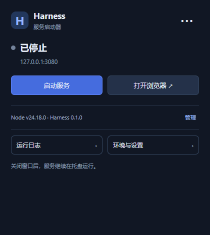

# Harness Launcher

基于 Tauri 2 + Rust 的 Windows / macOS DeepSeek Harness 服务启动器。独立社区工具。Windows 使用系统 WebView2，macOS 使用 WKWebView；不包含 Chromium、Node 或 Harness。

[下载发布版](https://github.com/ch3n4y/harness-launcher/releases/latest) · [构建状态](https://github.com/ch3n4y/harness-launcher/actions)

主窗口宽 420 逻辑像素，使用自绘窗口按钮，无系统标题栏；高度随页面和内容自动调整，超过屏幕可用高度时滚动。拖动顶部空白区域移动窗口。环境与设置、安装管理和运行日志通过右上角菜单或底部入口打开，Escape 返回首页。



## 使用

1. 安装 Node 22.19+（22.x）或 24+，启动 GUI。
2. 在“环境与设置”中选择工作目录；从候选列表选择 Node 或填写绝对路径，并保存设置。自动检测读取 PATH、登录 Shell 环境、NVM_BIN / NVM_DIR，并优先使用已安装 dsh 的兼容环境；支持 Finder 启动时的 nvm 检测。
3. 在“安装管理”中安装 Harness，通过所选 Node 配套 npm 执行 `npm install -g @deepseek-ai/dsh@latest`。已有全局安装直接复用。
4. 返回首页启动服务。默认地址 http://127.0.0.1:3080。

API Key 和模型在 Harness 网页中设置。关闭窗口隐藏到托盘，退出会停止由启动器创建的进程。托盘菜单随状态更新：停止时提供启动，运行时提供停止和重启，启动中提供停止，安装或停止过程中只显示进度。Windows 使用进程树终止，macOS 先发送 SIGTERM 再处理未退出进程。停止可能中断正在执行的 Harness 任务。

GUI 与终端共用 npm 全局安装。终端必须使用同一 Node/npm 环境，并将 npm 全局 bin 目录加入 PATH 才能直接运行 `dsh`。切换 Node 后会重新检测；不会通过 sudo 或管理员提权安装。npm 的 registry、代理和 prefix 沿用用户配置及工作目录配置。

## 开发和打包

需要 Rust、Node/npm；Windows 需要 Visual Studio C++ Build Tools，macOS 需要 Xcode Command Line Tools。

```sh
npm ci
npm test
npm start
npm run dist:win
# 在 macOS 上执行
rustup target add aarch64-apple-darwin x86_64-apple-darwin
npm run dist:mac
```

Windows 目标为 x64 EXE 和 NSIS 安装包，安装包在缺少 WebView2 时下载运行时。macOS 使用 `universal-apple-darwin` 生成一个同时包含 arm64 和 x86_64 的 Universal DMG，Intel 和 Apple Silicon 用户下载同一个安装包。公开分发的 macOS 包需要在 Mac 上配置开发者签名、公证和实机验证。

服务启动固定使用 `web --no-open`；启动器等待 HTTP 成功后按开关打开浏览器。首版固定使用默认 3080 端口，不支持自定义 Harness 监听地址。已有自定义配置改变地址时需恢复默认配置。

日志仅在内存保留最近 1200 条，单条最大 16000 字符。退出不保留日志，可手动导出；分享日志前检查敏感内容。配置保存于系统应用配置目录下的 `local.harness.launcher/config.json`。安装管理中支持检查 GitHub 最新正式版、查看更新说明、下载对应平台安装包并校验 SHA256。macOS 统一下载 Universal DMG。点击“下载并打开安装包”后，请从托盘退出启动器，再按系统安装提示完成更新；不进行静默覆盖。下载失败或校验失败不会替换当前应用。不支持卸载、开机自启。

## 自动发布

GitHub Actions 在 main 分支推送和 PR 时执行测试与 Windows / macOS Universal 打包，构建产物保留 14 天。推送 `v*` 标签时，检查版本一致性，所有构建通过后自动发布 GitHub Release，附带 Windows x64 NSIS 安装包、macOS Universal DMG 和 SHA256 校验文件。

发布前同步修改 `package.json`、`package-lock.json`、`src-tauri/Cargo.toml`、`src-tauri/Cargo.lock`、`src-tauri/tauri.conf.json` 的版本，并更新 `RELEASE_NOTES.md`，然后提交并推送对应标签（如 `v0.1.1`）。发布仅使用仓库自带的 `GITHUB_TOKEN`，无需保存个人访问令牌。

macOS 默认使用 ad-hoc 签名（`signingIdentity: "-"`），合并 Universal 后由打包器签名，CI 使用 `codesign --verify --deep --strict` 校验最终 App，并验证 arm64 / x86_64 双架构。ad-hoc 不提供 Apple Developer ID 身份或公证，不能消除 Gatekeeper 首次打开提示。未来公开可信分发需要 Developer ID 证书及公证凭据。Windows 尚未配置代码签名；macOS CI 构建不能替代实机交互验证。
